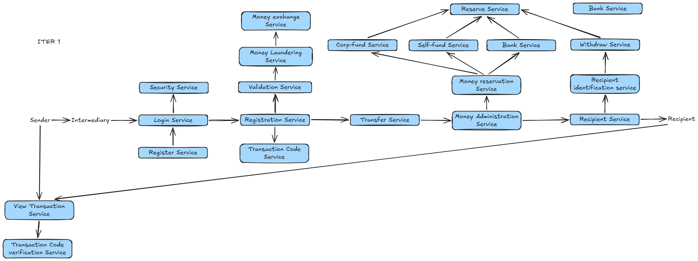
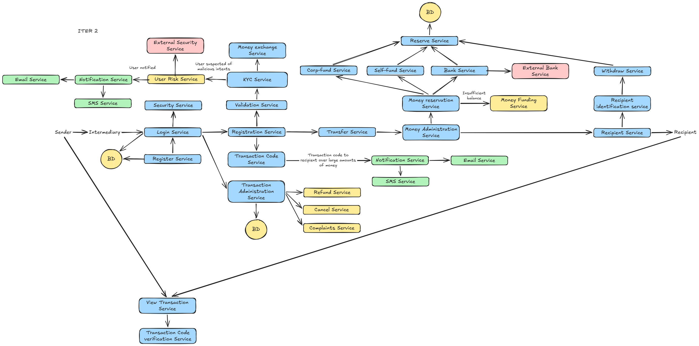
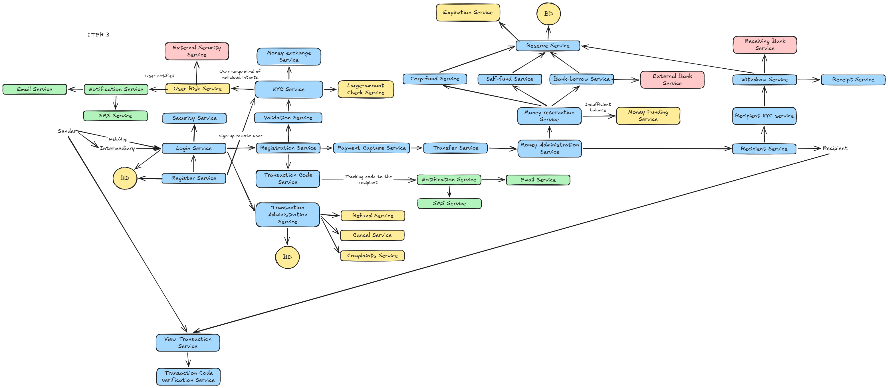

# SendIt - R.E.D.A.L.E.

An international remittance service, with Western Union as the reference model.

Model user: the Sender. He is the one who decides to use SendIt. The Recipient and the
Branch Agent use the system but do not choose it.

How the service works: the Sender starts the transfer from the mobile app, from the
website, or in person at a SendIt branch. In person he pays cash or card at the counter;
from the app or website he pays by debit from a linked bank account or by card online,
through a PCI payment gateway. SendIt keeps the funds, charges a fee, applies an exchange
rate, sets the payout amount aside in a destination-country reserve, and delivers the money
to the Recipient in the destination country. There are two payout channels: cash pickup at
a branch, or deposit into a bank account. SendIt acts as the intermediary for the whole
operation and executes every payout itself. When a destination reserve is short, SendIt
borrows from an outside bank only to top the reserve up; that borrowed money never touches
the recipient. The Sender can cancel and be refunded any time before the remittance is
paid.

Both parties go through an **identity check (KYC)**: a check run by an outside provider that
confirms a person is who they say they are. Before a large transfer, the app asks a remote
sender for an **extra check for large amounts** (a second KYC check) on top of the
logged-in session.

---

## R - Requirements

### Problems to solve

Sender:
- His bank does not allow transfers to banks in other countries.
- Going through several intermediaries makes the transfer slower and more expensive.
- He does not know how much will arrive, or how much he is being charged, before paying.
- After handing over the money he cannot tell what happened to it.
- If he changes his mind or makes a mistake, he wants his money back before it is handed
  to the recipient.

Recipient:
- He does not know if the money arrived and has no account to check it with.
- The money takes too long to become available.
- Another person could present himself as him and collect the money.

SendIt at the counter:
- Money can be taken before knowing who the sender is, leaving the agent holding cash for
  a remittance that was not valid.
- Cash can be given to the wrong person if identity is not checked against the data
  registered in the remittance.
- The same remittance can be paid twice if two branches try to pay it at the same time.
- There may be no money available in the destination country when the recipient arrives.
- Money that nobody collects stays open with no end date.
- Without a record that cannot be modified there is no way to prove what was collected and
  what was paid.

### Functional requirements

- Register branch agents, authenticate them at the counter and control what each one can
  do according to his role.
- Register senders who use the app or website: run a KYC check and verify ownership of the
  linked bank account or card once, at registration. Branch senders have no account.
- Run a KYC check on the sender before creating the remittance. No amount is exempt. In
  person this is done on every branch visit. On the app or website it is done once at
  registration; each later remittance needs a logged-in session, and any remittance over
  the large-amount threshold needs an extra KYC check.
- Reject any remittance that would take a customer over the per-customer daily send limit,
  counted across all channels.
- Run a KYC check on the recipient against the data registered in that remittance before
  releasing any money.
- Act on the KYC provider's User Risk flag: hold the remittance, notify the user and
  hand the case to the external security service.
- Quote the exchange rate and the fee, and hold both for a fixed window before the sender
  confirms.
- Create the remittance on an active corridor.
- Capture the payment: in person at the counter (cash or card on the POS), or remotely
  from the app or website (debit from a linked bank account, or card online through a
  PCI payment gateway).
- Generate a unique tracking code for each remittance.
- Allow the status to be consulted with the tracking code alone, without an account.
- Notify sender and recipient on each change of state.
- Reserve the payout amount in the destination country before announcing the money as
  available.
- Take the reserved funds from SendIt's own cash, from the corporate account or from bank
  partners, in that order.
- Pay out as cash at a branch or as a deposit into a bank account.
- Allow one single payout per remittance.
- Let the sender, or an agent on his behalf, cancel a remittance any time before it is
  paid. Release its reservation and refund the amount charged in full to the original
  payment method.
- Expire the remittances that are not collected within the collection window, release the
  reservation and keep the funds.
- Issue a receipt when the remittance is paid.
- Register every change of state in a record that cannot be modified afterwards.

### Non-functional requirements

Targets are split by path. The **sending path** (quote, create, pay) and the **status
lookup** are where a person is standing and waiting, so they get tight targets. The
**payout path** is looser on purpose: the recipient has up to 30 days to collect, so a
payout delayed by minutes, or retried an hour later, costs nothing.

**Consistency**
- Anything that touches money (payment capture, reservation, payout, refund, ledger) is
  strongly consistent: one all-or-nothing database transaction. A reserve balance can
  never go negative.
- The status shown to sender and recipient may lag the true state by up to **5 seconds**
  (served from read replicas and cache).

**Availability (per month)**
- Quote + create + pay: **99.9%** (about 43 min/month down).
- Status lookup: **99.9%**.
- Payout: **99.5%** (about 3.6 h/month) is acceptable: a missed payout is retried and the
  recipient still has days left.
- One external provider being down (KYC, gateway, one receiving bank, SMS) must not take
  the counter down: the branch can still quote, create, and pay out cash for remittances
  already `Ready for pickup`.

**Latency (per request, at peak load)**
- Quote: p50 < **300 ms**, p99 < **1 s** (the FX rate is cached, refreshed every 60 s).
- Status lookup: p50 < **100 ms**, p99 < **400 ms**.
- Create remittance (incl. sender KYC and limit checks): p99 < **5 s** (bounded by the
  external KYC call).
- Cash payout at the counter (ID match and release): p99 < **3 s**.

**Money-available timing** (this is where "the recipient can wait days" is used)
- Cash-funded remittance: `Ready for pickup` within **2 minutes** of payment.
- Online-card-funded: within **24 hours** (held until the charge is past the immediate
  chargeback window).
- Bank-debit-funded: within **3 business days** (held until the debit settles).
- Collection window after that: **30 days** (see Parameters).

**Durability and recovery**
- A committed money movement is never lost: **RPO = 0** for the transactional database
  (synchronous replication).
- **RTO <= 15 min** for the sending path; **RTO <= 2 h** for the payout path.

**Security**
- Card numbers are never stored; only gateway tokens (keeps SendIt in the smallest PCI
  scope).
- Personal documents and bank-account numbers are encrypted at rest (AES-256) and in
  transit (TLS 1.2+).
- Least privilege: an agent sees only their own branch's remittances; a refund needs a
  supervisor.
- The audit trail and the ledger are append-only and kept for **>= 7 years**.

**Auditability**
- Every money movement is one row in an append-only ledger. A reconciliation job runs
  **daily** and raises an alert within **1 hour** if
  `collected != paid + refunded + held + kept`.

**Scalability**
- Handle the section-E volume (1M remittances/day, ~700 req/s peak) and **3x that within
  2 years** by adding country partitions and read replicas, with no redesign.

### Parameters

Concrete values used by the requirements above. Same values as `Eval-Spec.md` §5.1.

| Parameter | Value |
|---|---|
| Sending channels | 3: mobile app, website, branch |
| Sender payment methods | 4: cash, card on the branch POS, debit from a linked bank account, card online |
| Payout channels | 2: cash pickup at a branch, deposit to a bank account |
| Remittance states | 7: Created, Collected, Ready for pickup, Paid, Rejected, Expired, Cancelled |
| Quote validity window | 15 minutes from issue |
| Large-amount threshold | US$ 1,000 (or corridor equivalent) in one remittance or within 24 hours triggers an extra KYC check for a remote sender |
| Per-customer daily send limit | US$ 50,000 (or corridor equivalent) in any 24-hour window, added up across all channels, per verified customer |
| Sender KYC exemption threshold | None. Every remittance needs the sender KYC-checked, at any amount |
| Collection window | 30 days from the moment the remittance becomes Ready for pickup |
| Expired-funds handling | 100% kept by SendIt; no refund to the sender, no payout to the recipient |
| Refund on cancellation | 100% of `total_charged_to_sender`, by the same payment method the sender used, target 5 business days |
| Destination reserve funding order | 1) SendIt's own money already collected in that country, 2) SendIt corporate account, 3) borrowed from the External Bank Service |
| Tracking code format | 10 characters, uppercase letters and digits, checked for repeats when issued |
| Recipient KYC re-check | Every remittance, never reused from a past one |
| Corridors by launch | At least 2 active country pairs by launch |

---

## E - Estimate

Inputs. Western Union is the reference for scale.

| Input | Value | Where it comes from |
|---|---|---|
| Agent locations | 500,000 | Published by Western Union, in 200 countries and territories |
| Customers served | 150M | Published by Western Union. A branch customer does not register; app and website senders do have an account, so a fraction of the 150M are accounts |
| Remittances per day | 1M | Western Union reported 75M transactions in Q4 2024, around 300M per year, which is 820,000 per day. Rounded up for headroom |
| Status checks per remittance | 10 | Assumption. Sender and recipient both check until the money is collected |
| Peak factor | 5 | Assumption, for paydays and weekends |

Load:
- Writes: 1M/day = 12 tx/s average, 60 tx/s peak.
- Status reads: 10M/day = 116 req/s average, 580 req/s peak.
- Session, quote and KYC operations (counter plus app and website: agent login, sender
  login, quote, large-amount check): 60 req/s peak. App and website shift part of this off
  the counter but do not change the order of magnitude.
- Total: 700 req/s peak.

Servers, taking 1 core at 5 req/s and a server of 32 cores at 160 req/s:
- 700 / 160 = 4.4, so 5 application servers.
- With N+1 redundancy in 3 regions: 30 application servers.
- CPU is not the limit: 60 writes/s is nothing for PostgreSQL. The real limit is
  **contention on one row: the destination reserve per country**, since many reservations
  in the same country compete to update the same balance. See section E - Scale for how it
  is split.

Storage, calculated from the data model in section A. One remittance and everything it
generates:

| Record | Per remittance | Size each | Subtotal |
|---|---|---|---|
| Remittance | 1 | 500 B | 500 B |
| Quote | 1.5, counting abandoned quotes | 100 B | 150 B |
| Payment | 1 | 100 B | 100 B |
| Reservation | 1 | 100 B | 100 B |
| Payout order | 1 | 100 B | 100 B |
| Receipt | 1 | 100 B | 100 B |
| KYC check | 2 (recipient every remittance, plus the sender for branch remittances or the one-time sign-up check for remote senders) | 400 B | 800 B |
| Audit event | 6, one per state change | 450 B | 2.7 KB |
| Ledger entry | ~8, a debit and a credit per money movement | 120 B | ~1 KB |
| Total | | | 6 KB |

- 1M/day x 6 KB = 6 GB/day, 2.2 TB/year.
- 10 years with 3 copies: 66 TB.
- Reference data is small: 500k agents and branches is around 170 MB, and corridors are a
  few dozen records.

### Bandwidth

One design choice keeps this small: **the ID-document photos go straight from the
customer's device to the KYC provider's SDK; SendIt only receives the yes/no verdict.**
Nothing heavy passes through SendIt.

| Traffic | Peak rate | Avg size (req + resp) | Peak bandwidth |
|---|---|---|---|
| Status lookups | 580 req/s | ~1.3 KB | ~6 Mbps |
| Sending path (create / pay / cancel) | 60 req/s | ~3 KB | ~1.5 Mbps |
| Sessions, quotes, large-amount checks | 60 req/s | ~2 KB | ~1 Mbps |
| Calls out to the KYC provider (data only) | ~120 req/s | ~4 KB | ~4 Mbps |
| Calls out to payment gateway / receiving banks | ~45 req/s | ~2 KB | ~1 Mbps |
| Notifications out (SMS + email provider) | ~460 msg/s | ~1.2 KB | ~4.5 Mbps |
| Internal event bus (fan-out ~5) | ~300 msg/s | ~1 KB | ~2.5 Mbps |
| DB replication + cross-region audit stream | steady | n/a | ~3 Mbps |
| Nightly backup ship (4 h window) | n/a | 5 GB / 4 h | ~3 Mbps |

**Peak aggregate ~25-30 Mbps per region**, about a third of it notifications and data-only
KYC calls. Provision **100 Mbps per region** for headroom. Bandwidth is not a constraint;
it would only become one if document images were routed through SendIt, which the design
avoids.

---

## D - Design the services

### Architecture

**Choice: a 3-tier modular monolith for the synchronous core, plus an event-driven
backbone for everything asynchronous.**

| Pattern | Fits here? |
|---|---|
| **Monolith** | Mostly. Small team, and the domain is now well understood. But status reads must scale on their own, which a plain monolith does not give. |
| **3-Tier** | Yes. Three channels (app, website, branch terminal) sit cleanly on one shared logic layer on one data layer. This is the shape used. |
| **Microservices** | Not yet. One team, and the whole thing is a single money-consistency boundary; splitting it now buys distributed-transaction pain for no scaling gain. The module seams (Access, Create, Money movement, Payout, Status, Admin) are kept clean so it *can* be split later. |
| **Event-driven** | Yes, for the async half. Notifications, KYC callbacks, receiving-bank confirmation, reserve top-up, funding-hold release and the expiration sweep are all fire-and-forget work, and because the recipient can wait days, moving them off the request path costs no user-visible delay. |

So: one deployable app, 3-tier inside, modules along the service groups below. The
synchronous request path (quote, create, pay, status, cash-payout ID match) is plain
request/response. Everything else travels as a domain event on a message bus and is
handled by workers.

### Data store: relational (PostgreSQL)

**The data is a set of tables that point at each other.** A remittance points to a quote,
a corridor, a payment, a reservation, a payout order, a receipt, KYC checks and audit
events. That is what a relational database is for. Four reasons it has to be relational
here:

1. **Money needs "all of it, or none of it".** Capturing a payment must, in one
   indivisible step, mark the remittance `Collected`, write the payment row, write the
   ledger entry and write the audit event. A relational database does that as a single
   transaction; with most NoSQL stores it has to be built by hand.
2. **Rules span several rows.** "Does this reservation still fit in what is left of the
   country's reserve?" means read the reserve row, compare, and update it with nobody
   slipping in between. That needs a row lock (`SELECT ... FOR UPDATE`), which relational databases
   do and key-value stores do not.
3. **The totals must match exactly** (`collected = paid + refunded + held + kept`). With a
   ledger table that is one `SUM` query, run daily.
4. **Auditors and finance people expect SQL.** "Every remittance on the Peru->US corridor
   last month over US$ 5,000" is a `WHERE` clause, not a new index design.

NoSQL's main strengths, a flexible schema and very high write throughput, do not help
here: the shape is known and stable, and writes peak at ~60/s, which is small for
PostgreSQL. Scale still comes where it grows: **reads** (status lookups, 10x the writes)
go to read replicas and a cache; **writes** are split into **one database per destination
country**, which is where the scarce, contended resource, the reserve, lives. Each
remittance lives in its destination country's database; origin-side steps write to it from
the origin application tier. ACID holds inside each country partition, which is all the
money math needs.

### Services

Access and identity. Branch agents have an account. An agent works the counter; a
supervisor is an agent who can also approve a cancellation and its refund. Senders who use
the app or website also have an account, which holds their KYC result and their linked
funding sources. Branch senders and all recipients have no account.

| Service | What it does |
|---|---|
| Register Service | Registers an account holder, whether a branch agent or an app or website sender. A sender sign-up also runs the KYC check and verifies ownership of the linked bank account or card; an agent sign-up does not |
| Login Service | Authenticates the account holder, at the counter or from the app or website, and opens the session that every remote remittance requires |
| Security Service | Session security, permissions and what each account holder is allowed to do |
| Large-amount Check Service | Requests the extra KYC check when a remittance is over the large-amount threshold |

Creating the remittance.

| Service | What it does |
|---|---|
| Registration Service | Registers the remittance: amount, corridor, recipient and payout channel |
| Validation Service | Validates the remittance data: active corridor, complete recipient data, per-customer daily send limit across all channels |
| KYC Service | Checks who the sender is. Runs the sender's KYC check with the external provider and takes its verdict, including the User Risk flag. A branch sender is checked on every visit; a remote sender is checked once at sign-up, plus an extra check over the large-amount threshold. Payment capture is blocked until it approves. The recipient is checked later, at payout, by the Recipient KYC Service |
| User Risk Service | Receives from the KYC Service the users the provider warns may be acting in bad faith, notifies the user and hands the case to the external security service |
| Money exchange Service | Gets the rate from the FX provider and locks the quote for its validity window |
| Transaction Code Service | Generates the tracking code |
| Payment Capture Service | Takes the payment: cash or card on the POS at the counter, or a bank-account debit or online card payment for app and website senders, the card leg through a PCI payment gateway. Until it succeeds there is no money |

Moving the money.

| Service | What it does |
|---|---|
| Transfer Service | Hands the remittance to the destination side once payment is collected and triggers the reservation. There is no cross-border movement of the sender's own cash: SendIt keeps what it collected in the origin country and pays the recipient out of its destination-country reserve |
| Money Administration Service | Controls the money: what came in, what is payable and what was paid |
| Money reservation Service | Registers the reservation of money for a remittance: which funds, from which source and against which remittance. The reservation is a record, not a transfer |
| Reserve Service | The pool of funds SendIt holds in each country and how much of it is already reserved |
| Self-fund Service | SendIt's own cash, money already collected from other senders in that country. First source used |
| Corp-fund Service | SendIt's corporate account. Second source, used when the own cash does not cover the amount |
| Bank-borrow Service | Borrows funds into the reserve from the External Bank Service. Third and last source, used when neither the own cash nor the corporate account cover the amount |
| Money Funding Service | Runs the three sources in order (Self-fund, Corp-fund, Bank-borrow) to bring the reserve up to the amount a reservation needs in the destination country |

Paying out.

| Service | What it does |
|---|---|
| Recipient Service | Handles the recipient on the destination side |
| Recipient KYC Service | Runs the recipient's KYC check against the data registered in that remittance. Blocks the release if it does not match |
| Withdraw Service | Releases the money, as cash at the branch or as a deposit. Guarantees a single payout even if two branches try at the same time |
| Receipt Service | Issues the proof of the paid remittance to both parties |

Status and closing.

| Service | What it does |
|---|---|
| View Transaction Service | Shows the status to sender or recipient, without an account |
| Transaction Code verification Service | Validates the tracking code used to look up or to collect |
| Expiration Service | Expires remittances that pass the collection window. The funds stay with SendIt and the reservation returns to the reserve |

Administration of the transaction.

| Service | What it does |
|---|---|
| Transaction Administration Service | Entry point for everything that happens to a remittance after it is registered and outside the normal flow |
| Cancel Service | Cancels a remittance that is Created, Collected or Ready for pickup. Releases any reservation and moves it to Cancelled |
| Refund Service | Returns `total_charged_to_sender` in full to the original payment method after a cancellation, or after a User Risk case confirmed once money was collected |
| Complaints Service | Registers and follows up the claims of sender or recipient. A dispute about an already-paid remittance is out of scope |

Notifications.

| Service | What it does |
|---|---|
| Notification Service | Notifies sender and recipient on each status change, and sends the tracking code to the recipient when the remittance is ready for pickup |
| Email Service | Delivers the notification by email |
| SMS Service | Delivers the notification by SMS |

External systems.

| Service | What it does |
|---|---|
| External Security Service | Receives the cases handed over by the User Risk Service |
| External Bank Service | An outside bank, or any other funding source, that SendIt borrows from to top up a destination-country reserve when its own cash and corporate account do not cover a payout. It funds the reserve; it never pays the recipient |
| Receiving Bank Service | The recipient's bank. Receives the credit instruction for a deposit payout and confirms it |

### API design

**REST + JSON over HTTPS** for every client-facing and partner-facing call. The app, the
website and the branch terminal are all thin clients doing CRUD-shaped operations, which
is what REST is built for. **Domain events on the message bus** for internal async work.
GraphQL is not needed (few, stable resources); WebSocket is not needed (status is polled
or pushed by notification, and the recipient can wait); gRPC is held in reserve for
service-to-service calls if the monolith is ever split.

Conventions:

- Base path `/v1`; TLS 1.2+ only. Money is sent as **integer minor units + ISO currency
  code** (`{"amount": 27000, "currency": "USD"}`) so there is no rounding drift and 0- and
  3-decimal currencies just work.
- `Idempotency-Key` (a UUID) is **required** on every money-moving `POST`. The server
  stores the result under that key for 24 h and replays it on a retry, so a dropped
  network reply can never create a second remittance or a second payout.
- `Authorization: Bearer <session token>` for agent and sender calls; nothing for the
  public status endpoint; an HMAC signature for provider webhooks.
- Errors: `{"error": {"code": "...", "message": "...", "retriable": false}}` with the
  matching HTTP status (`400` bad input, `401/403` auth, `409` wrong state, `422` business
  rule, `429` rate limit, `503` a provider is down).
- Lists are cursor-paginated (`cursor`, `limit`).

Main endpoints:

| Method and path | Who calls it | What it does |
|---|---|---|
| `POST /v1/quotes` | sender / agent / anonymous | Price a transfer: returns fee, rate, destination amount, total, `expiresAt` (15 min) |
| `POST /v1/senders` | prospective remote sender | Sign up; runs the KYC check and the funding-source ownership check |
| `POST /v1/senders/{id}/funding-sources` | remote sender | Link a bank account or card |
| `POST /v1/sessions` / `DELETE /v1/sessions/current` | agent / sender | Log in (returns a session token) / log out |
| `POST /v1/remittances` | sender / agent | Create from a `quoteId` + recipient + payout channel. Runs sender KYC, daily-limit and corridor checks. `201`, or `422 {code: kyc_failed \| daily_limit_exceeded \| user_risk_hold \| inactive_corridor}` |
| `POST /v1/remittances/{id}/payment` | sender / agent | Capture payment (`cash` / `card_pos` / `bank_debit` / `card_online`). `200 {state: collected, fundsReadyBy}` or `402 payment_declined` |
| `GET /v1/remittances/{id}` | the sender / an agent | Full detail (amounts, state, timestamps) |
| `GET /v1/remittances?state=&cursor=` | signed-in sender / agent | List own or branch remittances |
| `POST /v1/remittances/{id}/cancel` | the sender / a **supervisor** | Cancel before payout -> `{state: cancelled, refund: {amount, method, etaBusinessDays: 5}}`, or `409 already_paid` / `409 already_expired` |
| `POST /v1/remittances/{id}/payout` | agent (cash) / internal worker (deposit) | Release the money. Runs the recipient KYC check + account-holder match. `200 {state: paid, receiptId}`, or `409 not_ready` / `422 recipient_kyc_failed` / `409 already_paid` |
| `GET /v1/remittances/{id}/receipt` | sender / recipient / agent | Receipt document reference |
| `GET /v1/status/{trackingCode}` | anyone, **no auth**, rate-limited | `{state, destinationAmount, destinationCurrency, collectBy, daysLeft}`, never anything that could authorize a payout |
| `POST /v1/webhooks/kyc` | KYC provider | Verdict + User Risk flag (HMAC-signed) |
| `POST /v1/webhooks/payment` | payment gateway | Settlement and chargeback events |
| `POST /v1/webhooks/receiving-bank` | receiving bank | Deposit confirmed / failed |

Internal events on the bus (not HTTP): `remittance.collected`, `reservation.held`,
`reservation.failed`, `remittance.ready`, `remittance.paid`, `remittance.cancelled`,
`remittance.expired`, `userrisk.raised`, `funds.hold.released`. Workers turn these into
notifications, receiving-bank instructions, reserve top-ups and the expiration sweep.

---

## A - Data model

All money amounts are stored as **integer minor units** of the row's currency (cents, or
whole yen for JPY, or thousandths for KWD), not as decimals. That removes rounding drift
and handles currencies with 0 or 3 decimal places. The tables below write them as
`decimal(x,2)` to stay readable; the stored form is the integer.

**Agent**
| Attribute | Data type |
|---|---|
| id | integer |
| branch_id | integer |
| name | string(120) |
| role | enum: agent, supervisor |
| password_hash | string(60) |
| status | enum: active, inactive |

**Branch**
| Attribute | Data type |
|---|---|
| id | integer |
| country | string(2) |
| city | string(80) |
| currency | string(3) |
| status | enum: open, closed |

**Corridor**
| Attribute | Data type |
|---|---|
| id | integer |
| origin_country | string(2) |
| origin_currency | string(3) |
| destination_country | string(2) |
| destination_currency | string(3) |
| status | enum: active, inactive |

**Quote**
| Attribute | Data type |
|---|---|
| id | integer |
| corridor_id | integer |
| origin_amount | decimal(14,2) |
| exchange_rate | decimal(12,6) |
| fee | decimal(12,2) |
| destination_amount | decimal(14,2) |
| expires_at | datetime |

**Sender**, only for app and website senders
| Attribute | Data type |
|---|---|
| id | integer |
| name | string(120) |
| document | string(20) |
| email | string(120) |
| phone | string(20) |
| kyc_result | enum: approved, rejected |
| kyc_checked_at | datetime |
| status | enum: active, blocked |

**Funding source**, the bank account or card a remote sender pays from
| Attribute | Data type |
|---|---|
| id | integer |
| sender_id | integer |
| type | enum: bank_account, card |
| reference | string(40), masked |
| ownership_verified_at | datetime |
| status | enum: active, removed |

**Remittance**
| Attribute | Data type |
|---|---|
| id | integer |
| tracking_code | string(10), unique, uppercase letters and digits, checked for repeats |
| quote_id | integer |
| corridor_id | integer |
| channel | enum: app, web, branch |
| sender_id | integer, empty for branch senders |
| sender_name | string(120) |
| sender_document | string(20) |
| recipient_name | string(120) |
| recipient_document | string(20) |
| origin_amount | decimal(14,2) |
| fee | decimal(12,2) |
| exchange_rate | decimal(12,6) |
| destination_amount | decimal(14,2) |
| payout_channel | enum: cash, deposit |
| state | enum: created, collected, ready_for_pickup, paid, rejected, expired, cancelled |
| created_at | datetime |
| collected_at | datetime, empty until the payment is captured |
| ready_at | datetime, empty until the funds are reserved |
| paid_at | datetime, empty until it is paid |
| cancelled_at | datetime, empty unless it is cancelled |
| expires_at | datetime |
| created_by_agent | integer, empty for app and website remittances |
| paid_by_agent | integer, empty until it is paid |

**Payment**
| Attribute | Data type |
|---|---|
| id | integer |
| remittance_id | integer |
| method | enum: cash, card_pos, bank_debit, card_online |
| amount | decimal(14,2) |
| captured_at | datetime |
| provider_reference | string(40), empty when cash. POS terminal reference for card_pos, gateway token for card_online, mandate reference for bank_debit |

**Reserve**
| Attribute | Data type |
|---|---|
| id | integer |
| country | string(2) |
| currency | string(3) |
| bucket | integer, 0 by default; only > 0 if the row is sharded because it runs hot |
| available_amount | decimal(18,2) |
| reserved_amount | decimal(18,2) |
| version | integer, bumped on every update (optimistic lock) |

**Reservation**
| Attribute | Data type |
|---|---|
| id | integer |
| remittance_id | integer |
| reserve_id | integer |
| amount | decimal(14,2) |
| source | enum: self_fund, corp_fund, borrowed |
| state | enum: held, released, consumed |
| created_at | datetime |
| released_at | datetime, empty while held |

**Payout order**
| Attribute | Data type |
|---|---|
| id | integer |
| remittance_id | integer |
| channel | enum: cash, deposit |
| bank_account | string(40), empty when cash |
| state | enum: pending, executed, failed |
| executed_at | datetime |

**Receipt**
| Attribute | Data type |
|---|---|
| id | integer |
| remittance_id | integer |
| issued_at | datetime |
| document_reference | string(60) |

**KYC check**, written once and not modified afterwards
| Attribute | Data type |
|---|---|
| id | integer |
| context | enum: registration, remittance, large_amount |
| remittance_id | integer, empty when context is registration |
| sender_id | integer, empty when the subject is a recipient |
| subject | enum: sender, recipient |
| subject_name | string(120) |
| subject_document | string(20) |
| document_type | string(30) |
| provider | string(30) |
| result | enum: approved, rejected |
| user_risk_flag | boolean |
| checked_at | datetime |

**Audit event**, written once and not modified afterwards
| Attribute | Data type |
|---|---|
| sequence | integer |
| remittance_id | integer |
| actor | string(30) |
| action | string(30) |
| state_before | string(20) |
| state_after | string(20) |
| occurred_at | datetime |

**Ledger entry**, append-only, one per money movement (double-entry: every movement writes a matching debit and credit)
| Attribute | Data type |
|---|---|
| id | integer |
| remittance_id | integer |
| movement | enum: collected, reserved, paid, refunded, expired_kept, hold_placed, hold_released, borrow_in, borrow_repaid |
| account | enum: sender_funds, destination_reserve, sendit_revenue, borrowed_funds |
| direction | enum: debit, credit |
| amount_minor | integer |
| currency | string(3) |
| occurred_at | datetime |

The Audit event records state changes: who moved the remittance from one state to the next.
The Ledger entry records money movements. The daily reconciliation adds up the ledger and
checks `collected = paid + refunded + held + kept`.

### Remittance states

Created, Collected, Ready for pickup, Paid, and the final states Rejected, Expired and
Cancelled.

| From | To | Trigger |
|---|---|---|
| Created | Collected | Payment captured, at the counter or through the gateway or bank debit |
| Created | Rejected | KYC check fails, payment is declined, the daily send limit is exceeded, or a User Risk case is confirmed. No money was taken |
| Collected | Ready for pickup | Payout amount reserved in the destination and tracking code issued |
| Collected | Rejected | A User Risk case is confirmed after collection. The collected money is refunded |
| Ready for pickup | Paid | Recipient KYC check validated and money released. The reservation is consumed |
| Ready for pickup | Expired | The collection window passes. The reservation is released and the funds stay with SendIt |
| Created / Collected / Ready for pickup | Cancelled | The sender cancels before payout. Any reservation is released; collected money is refunded in full |

There is no transition out of Paid. A paid remittance cannot be reversed. A later dispute
is registered as a new remittance and not as a change to this one.

---

## L - Components

### Iteration 1

Order enforced in this iteration: the sender passes a KYC check before the remittance is
created, the payout amount is reserved in the destination before the recipient is told the
money is available, and the recipient passes a KYC check before the money is released. The
sender reaches this flow from the app, the website or a branch; the payment step is a
counter capture, a gateway charge or a bank debit depending on the channel.

Only the path where every step works is drawn. Failures are not covered yet.

### Iteration 2

Blue services are SendIt's own, green ones are the delivery channels of the notifications,
yellow ones are the paths that only run under a specific condition, and pink ones are
external systems. The circles marked BD are the points where state is stored.

Each party is checked at its own moment: the sender by the KYC Service when the remittance
is created, the recipient by the Recipient KYC Service before the money is released. When a
check returns a User Risk flag the User
Risk Service takes the case, notifies the user and hands it to the external security
service; nothing advances until a verdict comes back. Notifications reach the user by
email or SMS, and the recipient gets the tracking code the same way.

The reservation of money asks the reserve of the destination country. When the balance is
not enough the Money Funding Service brings money in, taken from SendIt's own cash, then
the corporate account, then borrowed from the External Bank Service, in that order. The
borrowed money only tops up the reserve; the External Bank Service never pays the recipient.

A remittance that is already registered is handled by the Transaction Administration
Service, which covers the cancellation of a remittance that has not been paid and the
refund of the amount charged to the sender. A dispute about an already-paid remittance is a
new case, not a change to this one.

### Iteration 3

The digital channel is added. A sender now reaches the flow from the app or the website as
well as from the counter, and both paths authenticate through the same Login Service. Only
the sign-up differs, because registering a remote sender runs a KYC check and a
funding-source ownership check that registering an agent does not. A remote sender is
therefore checked once at sign-up instead of on every visit, and the Large-amount Check
Service asks for an extra check when the amount is over the large-amount threshold.

Payment becomes a step of its own. The Payment Capture Service sits between the
registration of the remittance and the transfer, so a remittance exists as Created before
any money is taken and only becomes Collected once the charge succeeds. The KYC verdict
gates it; a failure ends the remittance in Rejected with nothing charged.

The payout side is closed. The Withdraw Service releases the money by either channel: cash
at the branch, or a credit instruction to the Receiving Bank Service, which is the
recipient's own bank and not the External Bank Service, which only tops up the reserve and
never pays a recipient. The Receipt Service issues the proof to both parties, and the
Expiration Service returns the reservation to the reserve when the 30-day collection
window passes.

### Building blocks

On top of the services, the running system uses standard infrastructure:

| Block | Role here |
|---|---|
| Load balancer + API gateway | TLS termination, auth, and rate limiting at the edge (the public `GET /v1/status/{code}` is rate-limited here) |
| Application servers | The modular-monolith app, 30 of them (from the Estimate), stateless behind the balancer |
| PostgreSQL, one primary per destination country | The transactional store; each holds that country's reserve, remittances and ledger |
| Read replicas + cache | Serve status lookups (10x the write traffic) off the primary |
| Message bus | Carries the domain events (`remittance.collected`, `reservation.held`, `remittance.paid`, `userrisk.raised`, ...) to the workers |
| Workers | Consume events: send notifications, instruct the receiving bank, run reserve top-ups, release funding holds |
| Scheduler | Fires the expiration sweep, the funding-hold release and the daily reconciliation |
| Object storage | Holds receipt documents; the DB keeps only the reference |
| Provider adapters | One per external system (KYC, payment gateway, FX, receiving banks, SMS/email, borrowing bank), so one being slow or down does not stall the request path |

---

## E - Scale

| Load | What fails first | Response |
|---|---|---|
| One branch | Nothing | One server and one database |
| One country | Status lookups are more frequent than anything else | Read replicas and a cache for the lookup |
| Several countries | Reserve per country and cross-border latency | One database per **destination** country; the partition key is the destination country. Each remittance lives in its destination country's database (that is where the reserve is); origin-side steps write to it from the origin application tier |
| Full scale, 150M users | Contention on one reserve row per country | Guard the reserve row with a row lock or a single-writer queue per (country, currency). If one row still runs hot, shard the reserve into buckets per (country, currency) and pick a bucket per reservation. App tier scales out to the 30 servers from the Estimate; the DB scales by adding country partitions |
| Read traffic (10x writes) | Status endpoint | Read replicas + cache, and a rate limit on `GET /v1/status/{code}` at the API gateway |
