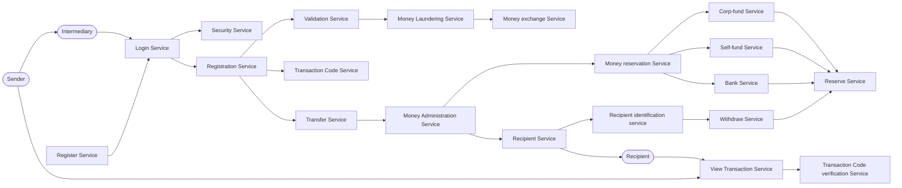

# SendIt — R.E.D.A.L.E.

Case Study #3 — Software Architecture, UTEC 2026-II. **Working draft.**

**Model user: the Sender.** He walks into a branch, hands over money, and picks the
platform. The Recipient and the Branch Agent are served, but they don't choose SendIt.

**How the service works** (per `README.md` on `dev-pedro`): the Sender goes **in person**
to a SendIt branch or agent and pays **cash or card at the counter**. SendIt holds the
funds, charges a fee, applies an exchange rate, and delivers to the Recipient in the
destination country through exactly **two channels**: cash pickup at a branch, or bank
deposit. SendIt is the **end-to-end intermediary** — payout is not delegated to a partner.

---

## R — Requirements

What the application must do:

- Register and authenticate users (sender, recipient, branch agent)
- Verify the sender's identity (KYC) before creating any remittance
- Quote the exchange rate and fee before the sender confirms
- Create a remittance for a supported corridor
- Capture payment at the counter: cash or card
- Generate a tracking code for the remittance
- Let anyone with the tracking code check status, with no account
- Notify sender and recipient on every status change
- Verify the recipient's identity before releasing any money
- Pay out by cash at a branch, or by deposit to a bank account
- Guarantee a remittance is paid out **exactly once**, even from two branches at once
- Expire uncollected remittances after the collection window
- Record every state change immutably for audit

Non-functional:

- **Consistency**: money collected always equals money payable; never paid twice, never lost
- **Security**: nobody collects a remittance that isn't theirs
- **Availability**: a branch counter can't be blocked by a slow external provider
- Encryption in transit and at rest

---

## E — Estimate

- 150M registered users, 550,000 agent locations (Western Union as reference)
- ~1M remittances/day → **12 tx/s average, ~60 tx/s peak**
- Reads dominate: sender and recipient both check status repeatedly until pickup
- Data per remittance is a few KB — **this system is not bandwidth-bound, it is
  consistency-bound**. The budget goes into the database, not into pipes.

*TODO: server count, storage total.*

---

## D — Design the services

**Access and identity**
| Service | What it does |
|---|---|
| Register Service | Creates the user account |
| Login Service | Authenticates the user at the counter |
| Security Service | Session security, 2FA, agent permissions |

**Creating the remittance**
| Service | What it does |
|---|---|
| Registration Service | Registers the remittance: amount, corridor, recipient, payout channel |
| Validation Service | Validates sender and recipient data and identity (KYC) |
| Money Laundering Service | Checks origin of funds / AML before the money is taken |
| Money exchange Service | Applies the exchange rate for the corridor and locks the quote |
| Transaction Code Service | Generates the tracking code for the remittance |

**Moving the money**
| Service | What it does |
|---|---|
| Transfer Service | Moves the remittance from origin to destination country |
| Money Administration Service | Owns the money: what came in, what is payable, what was paid |
| Money reservation Service | Reserves the payout amount in the destination so it can't be spent twice |
| Reserve Service | The pool of funds SendIt holds in each country |
| Corp-fund Service | Feeds the reserve with corporate capital |
| Self-fund Service | Feeds the reserve with money collected from other senders |
| Bank Service | Feeds/drains the reserve through SendIt's bank accounts |

**Paying out**
| Service | What it does |
|---|---|
| Recipient Service | Handles the recipient at the destination side |
| Recipient identification service | Verifies the recipient's identity for that specific remittance |
| Withdraw Service | Releases the money: cash at the branch or deposit to a bank |

**Looking it up**
| Service | What it does |
|---|---|
| View Transaction Service | Shows remittance status to sender or recipient, no account needed |
| Transaction Code verification Service | Validates the tracking code used to look up or collect |

---

## A — Data model

- User (sender / recipient / agent)
- Remittance
- Corridor
- Quote
- Payout order
- Branch
- Reserve

*TODO: fields, and which parts must be SQL (money) vs NoSQL.*

**Remittance states:** `Created` → `Collected` → `Ready for pickup` → `Paid`,
plus `Rejected` and `Expired`.

---

## L — Components

### Iteration 1

**Covered:** verified user in, remittance registered, money reserved and paid out,
status lookup by code.
**Not covered yet:** expiration after the collection window, refunds/rejections, and
what happens when an external provider (FX, KYC, bank) is down.

---

## E — Scale

*Not yet.*

---

## Open questions

1. **AML vs. scope.** Your diagram has a Money Laundering Service, but `dev-pedro`'s
   README lists compliance screening (sanctions/PEP, AML) as **out of scope**. One of the
   two has to give — decide before the Eval-Spec is graded against it.
2. **Where does the ordering matter?** Validation → AML → exchange happens *before* money
   is taken, which is right. Confirm the Transfer Service can't run before payment is
   actually captured.
3. **Reserve Service** is the piece that makes SendIt a real intermediary rather than a
   message passer. Worth its own iteration: what happens when a country's reserve is
   empty?
4. Sender pays cash **or card** at the counter — is card capture a service you own, or the
   POS terminal's? `dev-pedro` puts it out of scope (external processor).
